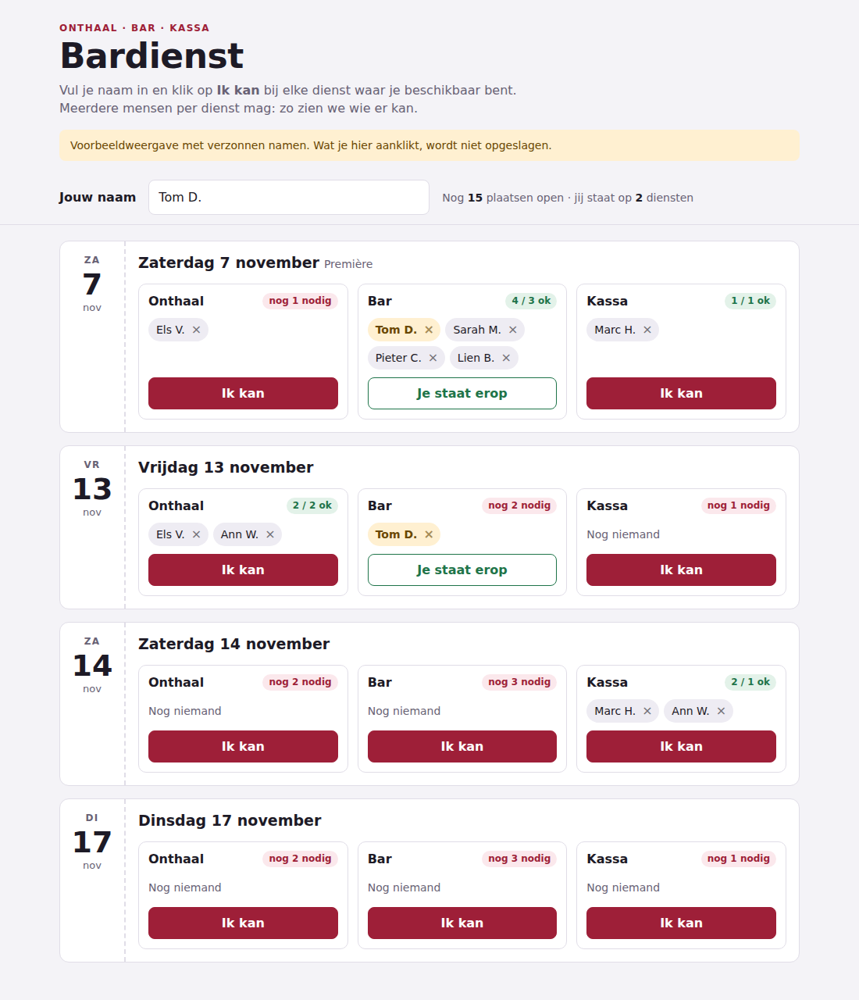

# Bardienst-rooster

Een webpagina waar leden van de toneelvereniging hun naam invullen voor de
diensten waar ze kunnen: **Onthaal**, **Bar** en **Kassa**. Per dienst kunnen
meerdere mensen zich opgeven. Je leden hebben geen account nodig: een link is genoeg.

Alles wordt opgeslagen in een Google Sheet. Daar kan je ook zelf de speeldagen
aanpassen en alle inschrijvingen bekijken.

## Installatie (±10 minuten, eenmalig)

1. Ga naar [sheets.new](https://sheets.new) en maak een nieuw Google Sheet,
   bijvoorbeeld *Bardienst 2026*.
2. Kies in het menu **Extensies → Apps Script**.
3. Vervang de inhoud van `Code.gs` door de inhoud van [`Code.gs`](Code.gs) uit deze map.
4. Klik links naast **Bestanden** op **+ → HTML**, noem het bestand `index`
   (zonder `.html`) en plak de inhoud van [`index.html`](index.html) erin.
5. Klik op **Opslaan** (diskette-icoon).
6. Klik rechtsboven op **Implementeren → Nieuwe implementatie**.
   - Type (tandwieltje): **Web-app**
   - Uitvoeren als: **Ik**
   - Wie heeft toegang: **Iedereen**
7. Klik op **Implementeren** en geef toestemming. Google waarschuwt dat de app
   "niet geverifieerd" is: kies **Geavanceerd → Ga naar … (onveilig)**. Dat is
   normaal voor je eigen script.
8. Kopieer de **URL van de web-app** (eindigt op `/exec`). Die link stuur je naar
   je leden, bijvoorbeeld via mail of WhatsApp.

Bij de eerste keer openen maakt het script twee tabbladen aan in je Sheet:

| Tabblad          | Wat staat erin                                                        |
|------------------|-----------------------------------------------------------------------|
| `Speeldagen`     | Eén rij per voorstelling: datum en optionele info (bv. "Première").   |
| `Inschrijvingen` | Wie zich voor welke dienst op welke dag heeft ingeschreven.           |

## Aanpassen

- **Speeldagen toevoegen of wijzigen**: pas het tabblad `Speeldagen` aan (datum
  in kolom A). De webpagina toont automatisch de nieuwe lijst. Voorbije dagen
  worden grijs weergegeven.
- **Aantal mensen per dienst of andere diensten**: pas `FUNCTIES` bovenaan
  `Code.gs` aan. Klik daarna op **Implementeren → Implementaties beheren →
  potloodje → Versie: Nieuwe versie → Implementeren**, zodat de link hetzelfde blijft.
- **Titel**: pas `TITEL` aan in `Code.gs`.
- **Nieuw seizoen**: maak het tabblad `Inschrijvingen` leeg (behalve de kopregel)
  en zet de nieuwe datums in `Speeldagen`.

## Hoe werkt het voor leden

1. Ze openen de link en typen één keer hun naam (die wordt onthouden op hun toestel).
2. Bij elke dienst waar ze kunnen, klikken ze op **Ik kan**.
3. Zich vergist? Klik op het kruisje naast de naam en bevestig met **Ja**.

Per dienst zie je meteen of er nog mensen nodig zijn (rood: "nog 2 nodig") of
dat het ingevuld is (groen). De pagina ververst elke 30 seconden vanzelf.

## Uitproberen zonder installatie

Open `index.html` gewoon in je browser. Je ziet dan een voorbeeldweergave met
verzonnen namen. Die wordt niet opgeslagen.
