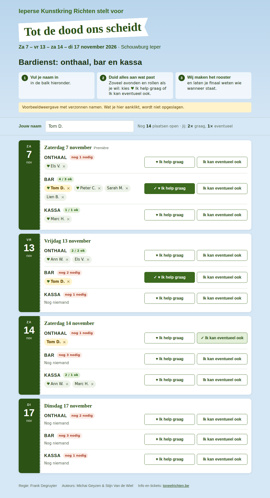

# Bardienst-rooster

Een webpagina waar leden van de toneelvereniging hun naam invullen voor de
diensten waar ze kunnen: **Onthaal**, **Bar** en **Kassa**. Per dienst kunnen
meerdere mensen zich opgeven. Je leden hebben geen account nodig: een link is genoeg.

Alles wordt opgeslagen in een Google Sheet. Daar kan je ook zelf de speeldagen
aanpassen en alle inschrijvingen bekijken.

## Installatie (±10 minuten, eenmalig)

1. Ga naar [sheets.new](https://sheets.new) en maak een nieuw Google Sheet,
   bijvoorbeeld *Bardienst 2026*.
2. Kies in het menu **Extensies → Apps Script**.
3. Vervang de inhoud van `Code.gs` door de inhoud van [`Code.gs`](Code.gs) uit deze map.
4. Klik links naast **Bestanden** op **+ → HTML**, noem het bestand `index`
   (zonder `.html`) en plak de inhoud van [`index.html`](index.html) erin.
5. Klik op **Opslaan** (diskette-icoon).
6. Klik rechtsboven op **Implementeren → Nieuwe implementatie**.
   - Type (tandwieltje): **Web-app**
   - Uitvoeren als: **Ik**
   - Wie heeft toegang: **Iedereen**
7. Klik op **Implementeren** en geef toestemming. Google waarschuwt dat de app
   "niet geverifieerd" is: kies **Geavanceerd → Ga naar … (onveilig)**. Dat is
   normaal voor je eigen script.
8. Kopieer de **URL van de web-app** (eindigt op `/exec`). Die link stuur je naar
   je leden, bijvoorbeeld via mail of WhatsApp.

Bij de eerste keer openen maakt het script twee tabbladen aan in je Sheet:

| Tabblad          | Wat staat erin                                                        |
|------------------|-----------------------------------------------------------------------|
| `Speeldagen`     | Eén rij per voorstelling: datum en optionele info (bv. "Première").   |
| `Inschrijvingen` | Wie zich voor welke dienst op welke dag heeft ingeschreven.           |
| `Opmerkingen`    | De vrije opmerking (max. 200 tekens) per persoon per speelavond.      |

Het rooster wordt tot 5 minuten in de cache van Google bewaard, zodat de pagina
snel laadt. Pas je zelf iets aan in het Sheet, dan wordt die cache automatisch
leeggemaakt.

## Aanpassen

- **Speeldagen toevoegen of wijzigen**: pas het tabblad `Speeldagen` aan (datum
  in kolom A). De webpagina toont automatisch de nieuwe lijst. Voorbije dagen
  worden grijs weergegeven.
- **Aantal mensen per dienst of andere diensten**: pas `FUNCTIES` bovenaan
  `Code.gs` aan. Klik daarna op **Implementeren → Implementaties beheren →
  potloodje → Versie: Nieuwe versie → Implementeren**, zodat de link hetzelfde blijft.
- **Titel**: pas `TITEL` aan in `Code.gs`.
- **Nieuw seizoen**: maak het tabblad `Inschrijvingen` leeg (behalve de kopregel)
  en zet de nieuwe datums in `Speeldagen`.

## Hoe werkt het voor leden

1. Ze openen de link en zien eerst een korte uitleg. Daar vullen ze hun naam in
   (die wordt onthouden op hun toestel) en klikken op **Start met inchecken ✈**.
2. Ze krijgen per speelavond een "boarding pass" met de rollen (gates) onthaal,
   bar en kassa. Per rol kiezen ze **♥ Ik help graag** of **Ik kan eventueel ook**.
   Kunnen ze niet, dan duiden ze niets aan. Nog eens klikken haalt een keuze weg.
3. Onderaan elke boarding pass kunnen ze een opmerking voor die avond kwijt
   (max. 200 tekens, bv. "pas vanaf 20u"). Die ziet alleen de persoon zelf op
   de pagina; jij vindt alle opmerkingen in het tabblad `Opmerkingen`.
4. Met **Volgende avond ✈** gaan ze verder; op het einde zien ze een overzicht
   van hun keuzes, met per avond een knop **Wijzig**.

Keuzes worden meteen bewaard. Per rol zie je of er nog mensen nodig zijn en wie
al ingecheckt is (♥ = helpt graag). In het tabblad `Inschrijvingen` staat de
voorkeur in de kolom `Voorkeur` als `liefst` (helpt graag) of `kan` (eventueel).
Voorbije speelavonden worden niet meer getoond.

## Uitproberen zonder installatie

Open `index.html` gewoon in je browser. Je ziet dan een voorbeeldweergave met
verzonnen namen. Die wordt niet opgeslagen.
